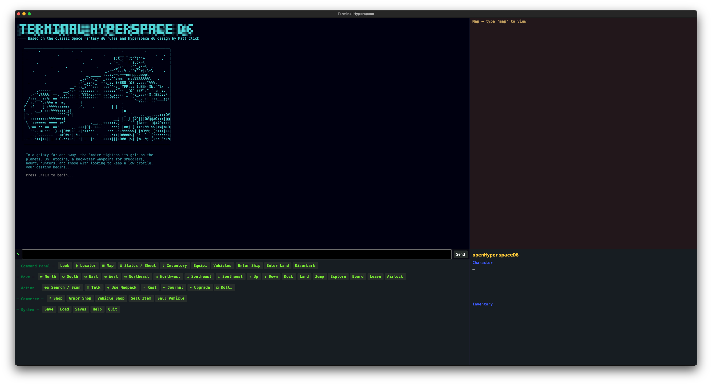
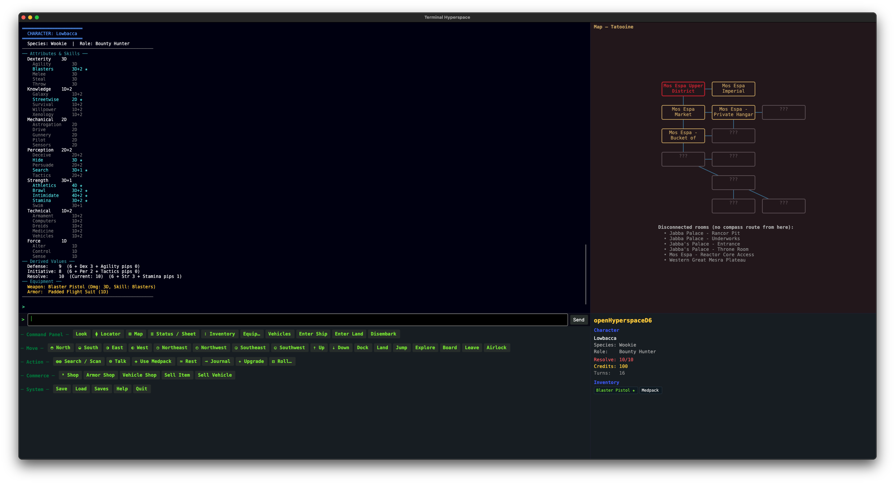
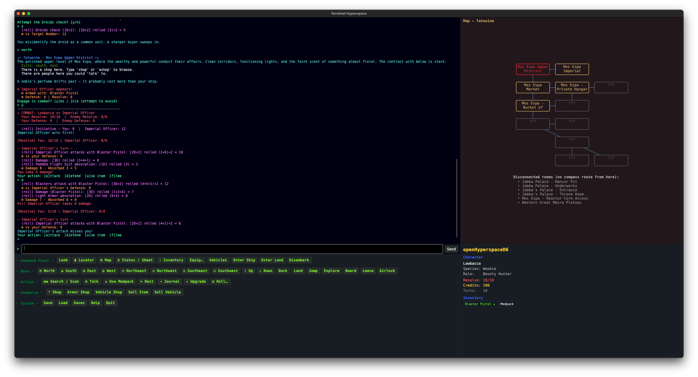

# terminalHyperspace

terminalHyperspace is a single-player, multi-user dungeon-like (or MUD-like). 

## System Requirements
- **Platform Neutral**. The game use .NET 10 to deliver a completely text-based experience through your terminal or command console.
- **.NET Based**. The dotnet runtime is required to build and/or run the app. A precompiled version is in the /bin folder.

## Current Features
- **Conflict resolution** using D6 + pip pools, i.e. 1D, 1D+1, 1D+2, 2D, etc.
- **Attribute and Skill systems**, including Skill checks based on select locations or talk with NPCs, themed and flavored.
- **Combat and Non-Combat Encounters** in land and space
- **Locations** with random encounter tables and percentile odds of encounter
- **Vendors** for both equipment and vehicles, with the ability to sell at a percentile of the original value based on Persuade Skill
- **Save and Load system** using TXT files stored as .SAV extension 

## Screenshots
  

## Credits & License
It's inspired by the West End Games d6 system and the world's most popular Space Fantasy movie series, using the Hyperspace d6 rules created by Matthew Click. This is a Creative Commons Attribution-NonCommercial-ShareAlike 4.0 International game due to these reasons, see https://creativecommons.org/licenses/by-nc-sa/4.0/ for full details.

### You are free to:
- Share — copy and redistribute the material in any medium or format
- Adapt — remix, transform, and build upon the material
The licensor cannot revoke these freedoms as long as you follow the license terms.

### Under the following terms:
- Attribution — You must give appropriate credit, provide a link to the license, and indicate if changes were made. You may do so in any reasonable manner, but not in any way that suggests the licensor endorses you or your use.
- NonCommercial — You may not use the material for commercial purposes.
- ShareAlike — If you remix, transform, or build upon the material, you must distribute your contributions under the same license as the original.
No additional restrictions — You may not apply legal terms or technological measures that legally restrict others from doing anything the license permits.

### Notices:
You do not have to comply with the license for elements of the material in the public domain or where your use is permitted by an applicable exception or limitation.

No warranties are given. The license may not give you all of the permissions necessary for your intended use. For example, other rights such as publicity, privacy, or moral rights may limit how you use the material.